# Other UI Libraries

Press on the names for more information. Sorry for any bad image qualities, I likely got the preview from a video or showcase of some sort.

## [Orion](https://github.com/shlexware/Orion)

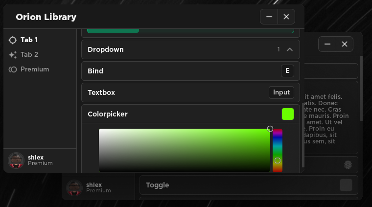

## [Material UI](https://github.com/Kinlei/MaterialLua)

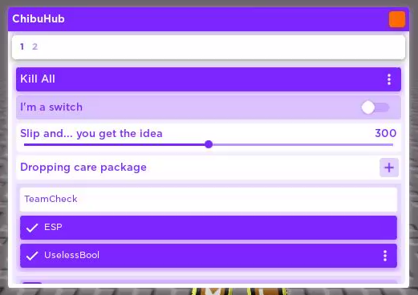

## [Venyx](https://github.com/GreenDeno/Venyx-UI-Library)

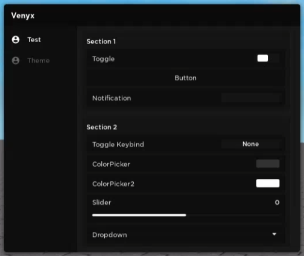

## [Solaris](https://v3rmillion.net/showthread.php?tid=1142474)

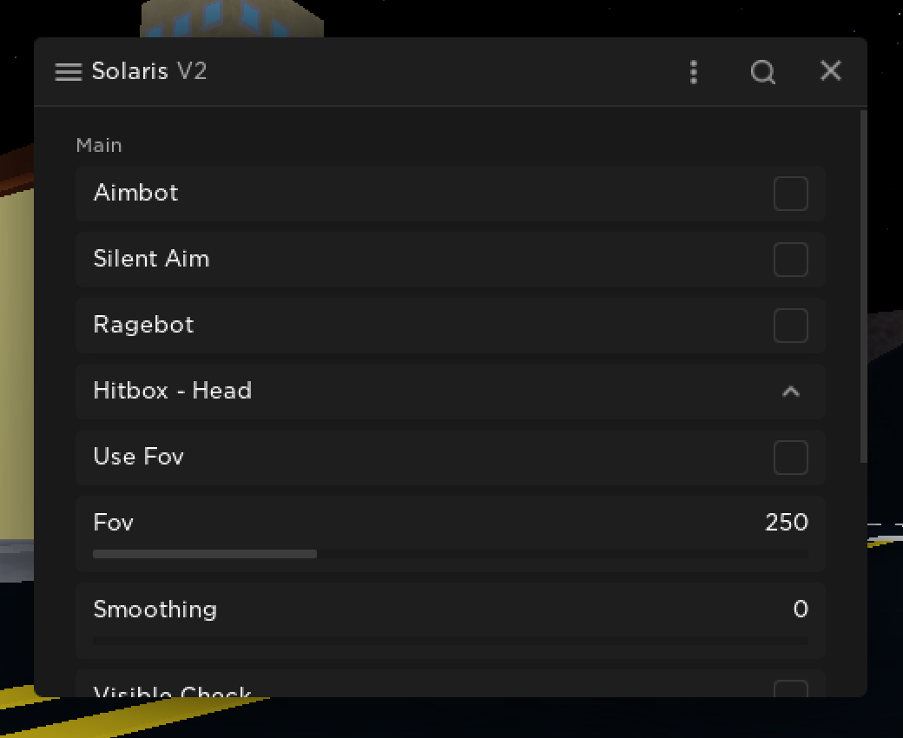

## [Ocerium](https://v3rmillion.net/showthread.php?tid=1167106)

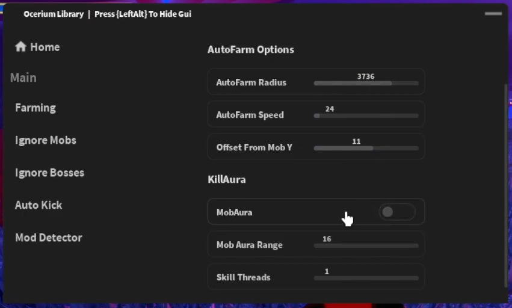

## [Blek](https://github.com/laderite/bleklib)

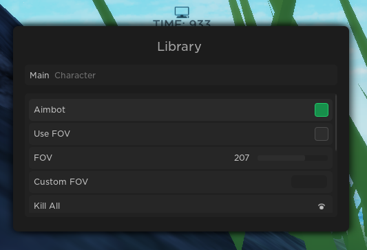

## [Kavo](https://xheptcofficial.gitbook.io/kavo-library/)

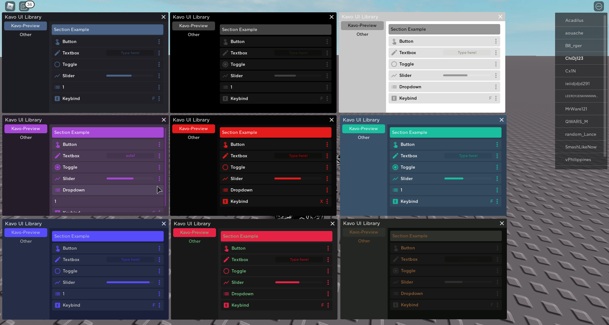

## [Flux](https://v3rmillion.net/showthread.php?tid=1101621)

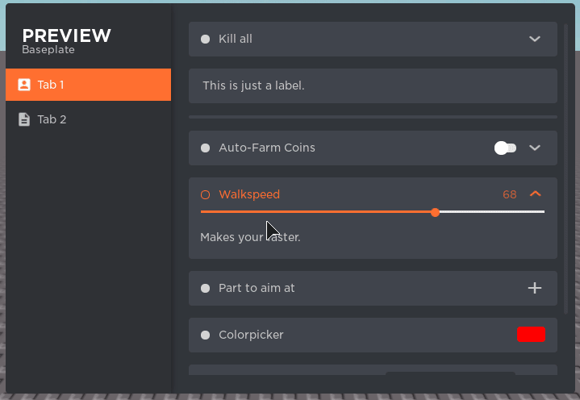

## [Mercury](https://github.com/deeeity/mercury-lib)

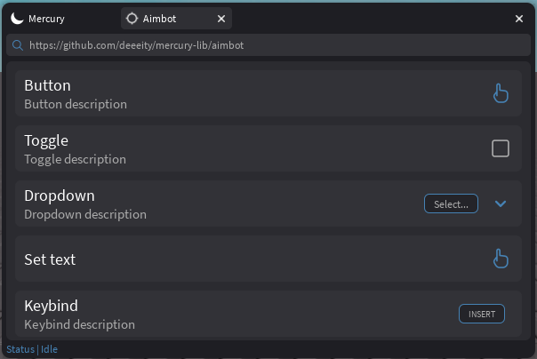

## [Cool](https://v3rmillion.net/showthread.php?tid=1151036)

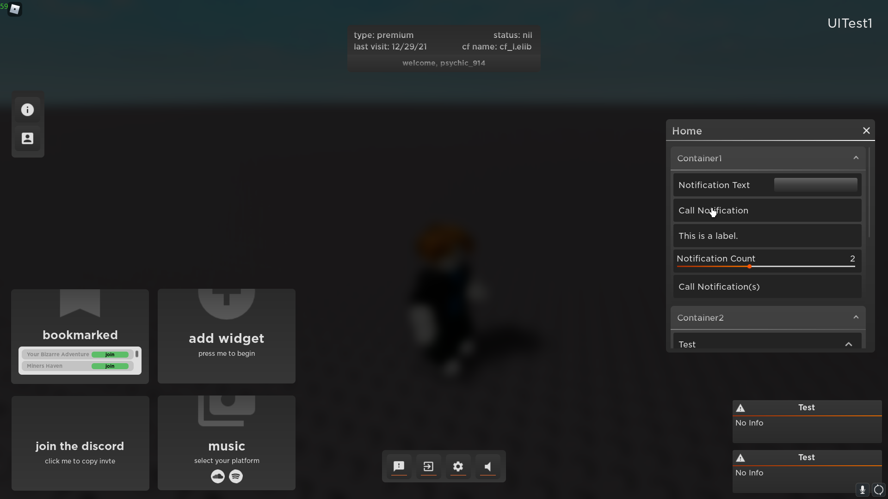

## [Xenon](https://v3rmillion.net/showthread.php?tid=1124739)

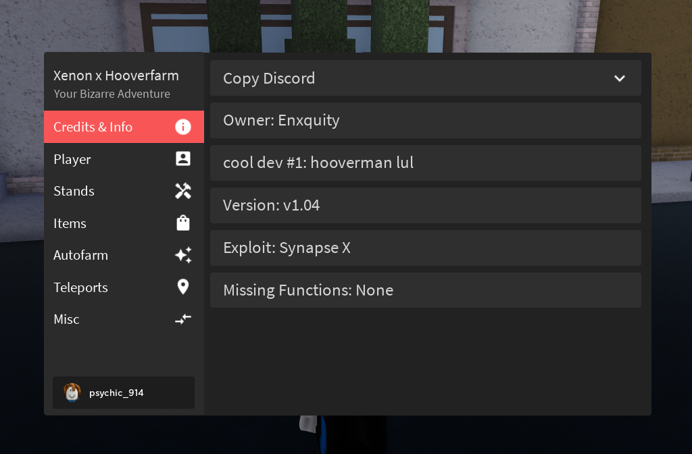

## [Slixx's](https://slixx.gitbook.io/untitled/)

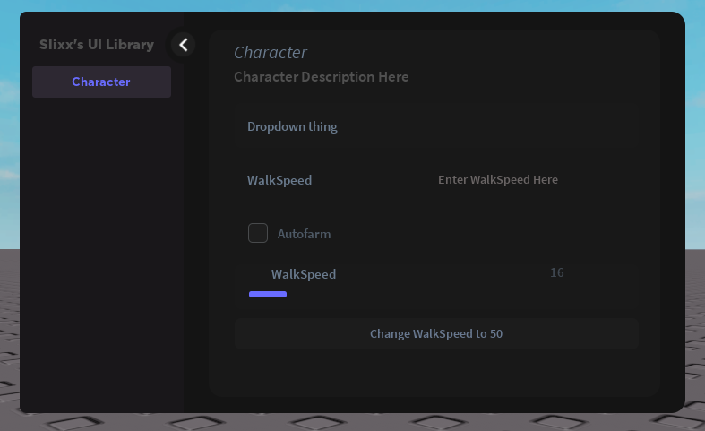

## [robloxscripts](https://v3rmillion.net/showthread.php?tid=1112691)

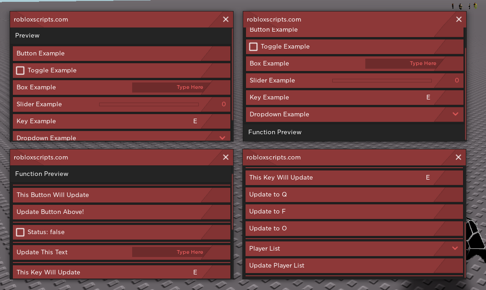

## [vape](https://v3rmillion.net/showthread.php?tid=1098651)

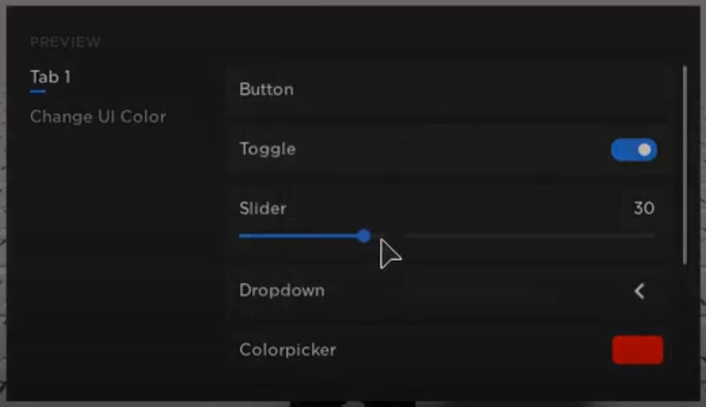

## [uwuware (wally)](https://github.com/wally-rblx/uwuware-ui/blob/main/main.lua)

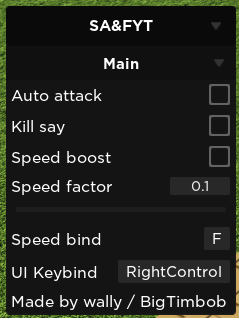

## [uwuware (Jan)](https://v3rmillion.net/showthread.php?tid=1023792)

I know this one uses the same image as wally's. I'm not bothered to get a preview if they look very similar.

